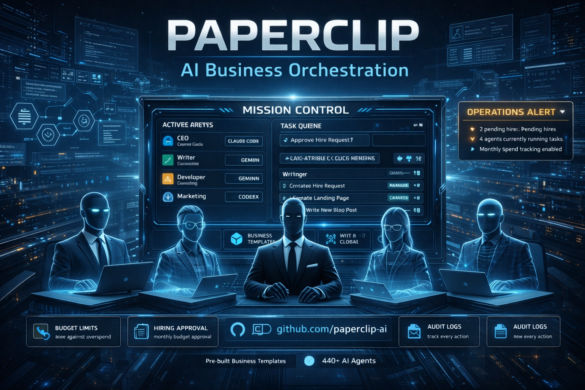

<p align="center">
  
</p>

<p align="center">
  <a href="#inicio-rapido"><strong>Início Rápido</strong></a> &middot;
  <a href="https://paperclip.ing/docs"><strong>Documentação</strong></a> &middot;
  <a href="https://github.com/paperclipai/paperclip"><strong>GitHub</strong></a> &middot;
  <a href="https://discord.gg/m4HZY7xNG3"><strong>Discord</strong></a>
</p>

<p align="center">
  <a href="https://github.com/paperclipai/paperclip/blob/master/LICENSE"></a>
  <a href="https://github.com/paperclipai/paperclip/stargazers"></a>
  <a href="https://discord.gg/m4HZY7xNG3"></a>
</p>

<br/>

<div align="center">
  <video src="https://github.com/user-attachments/assets/773bdfb2-6d1e-4e30-8c5f-3487d5b70c8f" width="600" controls></video>
</div>

<br/>

## O que é o Paperclip?

# Orquestração open-source para empresas sem humanos

**Se o OpenClaw é um _funcionário_, o Paperclip é a _empresa_**

O Paperclip é um servidor Node.js com UI React que orquestra uma equipe de agentes de IA para administrar um negócio. Traga seus próprios agentes, defina metas e acompanhe o trabalho e os custos dos seus agentes em um único painel.

Parece um gerenciador de tarefas — mas por baixo tem organogramas, orçamentos, governança, alinhamento de metas e coordenação de agentes.

**Gerencie metas de negócio, não pull requests.**

|        | Passo             | Exemplo                                                                        |
| ------ | ----------------- | ------------------------------------------------------------------------------ |
| **01** | Defina a meta     | _"Criar o app #1 de notas com IA até $1M MRR."_                               |
| **02** | Contrate a equipe | CEO, CTO, engenheiros, designers, marketeiros — qualquer bot, qualquer provedor. |
| **03** | Aprove e execute  | Revise a estratégia. Defina orçamentos. Dê o play. Monitore pelo painel.       |

<br/>

> **EM BREVE: Clipmart** — Baixe e execute empresas inteiras com um clique. Navegue por templates pré-construídos — estruturas organizacionais completas, configs de agentes e habilidades — e importe-os para sua instância do Paperclip em segundos.

<br/>

<div align="center">
<table>
  <tr>
    <td align="center"><strong>Funciona<br/>com</strong></td>
    <td align="center"><br/><sub>OpenClaw</sub></td>
    <td align="center"><br/><sub>Claude Code</sub></td>
    <td align="center"><br/><sub>Codex</sub></td>
    <td align="center"><br/><sub>Cursor</sub></td>
    <td align="center"><br/><sub>Bash</sub></td>
    <td align="center"><br/><sub>HTTP</sub></td>
  </tr>
</table>

<em>Se consegue receber um heartbeat, está contratado.</em>

</div>

<br/>

## O Paperclip é para você se

- ✅ Você quer construir **empresas autônomas com IA**
- ✅ Você **coordena vários agentes diferentes** (OpenClaw, Codex, Claude, Cursor) rumo a um objetivo comum
- ✅ Você tem **20 terminais Claude Code abertos** e perde o controle do que cada um está fazendo
- ✅ Você quer agentes rodando **autonomamente 24/7**, mas ainda quer auditar o trabalho e intervir quando necessário
- ✅ Você quer **monitorar custos** e impor orçamentos
- ✅ Você quer um processo para gerenciar agentes que **pareça um gerenciador de tarefas**
- ✅ Você quer gerenciar seus negócios autônomos **do celular**

<br/>

## Funcionalidades

<table>
<tr>
<td align="center" width="33%">
<h3>🔌 Traga Seu Próprio Agente</h3>
Qualquer agente, qualquer runtime, um organograma. Se consegue receber um heartbeat, está contratado.
</td>
<td align="center" width="33%">
<h3>🎯 Alinhamento de Metas</h3>
Toda tarefa remonta à missão da empresa. Os agentes sabem <em>o que</em> fazer e <em>por quê</em>.
</td>
<td align="center" width="33%">
<h3>💓 Heartbeats</h3>
Agentes acordam em um cronograma, verificam o trabalho e agem. Delegação flui para cima e para baixo no organograma.
</td>
</tr>
<tr>
<td align="center">
<h3>💰 Controle de Custos</h3>
Orçamentos mensais por agente. Quando atingem o limite, param. Sem custos descontrolados.
</td>
<td align="center">
<h3>🏢 Multi-Empresa</h3>
Um deploy, várias empresas. Isolamento completo de dados. Um painel de controle para seu portfólio.
</td>
<td align="center">
<h3>🎫 Sistema de Tickets</h3>
Toda conversa rastreada. Toda decisão explicada. Rastreamento completo de tool-calls e log de auditoria imutável.
</td>
</tr>
<tr>
<td align="center">
<h3>🛡️ Governança</h3>
Você é o conselho. Aprove contratações, sobrescreva estratégias, pause ou encerre qualquer agente — a qualquer momento.
</td>
<td align="center">
<h3>📊 Organograma</h3>
Hierarquias, cargos, linhas de reporte. Seus agentes têm um chefe, um título e uma descrição de cargo.
</td>
<td align="center">
<h3>📱 Mobile Ready</h3>
Monitore e gerencie seus negócios autônomos de qualquer lugar.
</td>
</tr>
</table>

<br/>

## Problemas que o Paperclip resolve

| Sem Paperclip                                                                                                                            | Com Paperclip                                                                                                                                     |
| ---------------------------------------------------------------------------------------------------------------------------------------- | ------------------------------------------------------------------------------------------------------------------------------------------------- |
| ❌ Você tem 20 abas do Claude Code abertas e não consegue rastrear o que cada uma faz. Ao reiniciar, perde tudo.                        | ✅ Tarefas são baseadas em tickets, conversas são organizadas em threads, sessões persistem entre reinicializações.                               |
| ❌ Você junta contexto manualmente de vários lugares para lembrar o bot do que está fazendo.                                             | ✅ O contexto flui da tarefa até o projeto e metas da empresa — seu agente sempre sabe o que fazer e por quê.                                    |
| ❌ Pastas de configs de agentes desorganizadas e você reinventando gestão de tarefas, comunicação e coordenação entre agentes.           | ✅ O Paperclip oferece organogramas, tickets, delegação e governança prontos — para você gerenciar uma empresa, não uma pilha de scripts.         |
| ❌ Loops descontrolados gastam centenas de dólares em tokens e estouram sua cota antes de você perceber.                                 | ✅ O rastreamento de custos mostra orçamentos de tokens e limita os agentes quando acabam. A gestão prioriza com orçamentos.                     |
| ❌ Você tem jobs recorrentes (suporte, redes sociais, relatórios) e precisa lembrar de iniciá-los manualmente.                           | ✅ Heartbeats cuidam do trabalho regular em um cronograma. A gestão supervisiona.                                                                |
| ❌ Você tem uma ideia, precisa achar o repo, abrir o Claude Code, manter uma aba aberta e ficar monitorando.                            | ✅ Adicione uma tarefa no Paperclip. Seu agente de código trabalha nela até terminar. A gestão revisa o trabalho.                                |

<br/>

## Por que o Paperclip é especial

O Paperclip lida com os detalhes difíceis de orquestração corretamente.

|                                        |                                                                                                                   |
| -------------------------------------- | ----------------------------------------------------------------------------------------------------------------- |
| **Execução atômica.**                  | Checkout de tarefas e enforcement de orçamento são atômicos — sem trabalho duplicado e sem gastos descontrolados.  |
| **Estado persistente do agente.**      | Agentes retomam o mesmo contexto da tarefa entre heartbeats, em vez de recomeçar do zero.                         |
| **Injeção de skills em runtime.**      | Agentes aprendem workflows do Paperclip e contexto do projeto em runtime, sem retreinamento.                      |
| **Governança com rollback.**           | Gates de aprovação são aplicados, mudanças de config são versionadas e erros podem ser revertidos com segurança.   |
| **Execução orientada a metas.**        | Tarefas carregam toda a ancestralidade de metas, para que os agentes vejam o "porquê", não apenas o título.       |
| **Templates de empresas portáteis.**   | Exporte/importe orgs, agentes e skills com remoção de secrets e tratamento de colisões.                           |
| **Isolamento multi-empresa real.**     | Toda entidade tem escopo de empresa, então um deploy pode rodar várias empresas com dados e auditoria separados.  |

<br/>

## O que o Paperclip NÃO é

|                                      |                                                                                                                          |
| ------------------------------------ | ------------------------------------------------------------------------------------------------------------------------ |
| **Não é um chatbot.**                | Agentes têm empregos, não janelas de chat.                                                                               |
| **Não é um framework de agentes.**   | Não dizemos como construir agentes. Dizemos como administrar uma empresa feita deles.                                    |
| **Não é um construtor de workflows.**| Sem pipelines drag-and-drop. O Paperclip modela empresas — com organogramas, metas, orçamentos e governança.             |
| **Não é um gerenciador de prompts.** | Agentes trazem seus próprios prompts, modelos e runtimes. O Paperclip gerencia a organização em que trabalham.            |
| **Não é ferramenta de agente único.**| Isso é para equipes. Se você tem um agente, provavelmente não precisa do Paperclip. Se tem vinte — com certeza precisa.  |
| **Não é ferramenta de code review.** | O Paperclip orquestra trabalho, não pull requests. Traga seu próprio processo de revisão.                                |

<br/>

## Início Rápido

Open source. Self-hosted. Sem necessidade de conta no Paperclip.

```bash
npx paperclipai onboard --yes
```

Ou manualmente:

```bash
git clone https://github.com/paperclipai/paperclip.git
cd paperclip
pnpm install
pnpm dev
```

Isso inicia o servidor da API em `http://localhost:3100`. Um banco PostgreSQL embarcado é criado automaticamente — sem configuração necessária.

> **Requisitos:** Node.js 20+, pnpm 9.15+

<br/>

## FAQ

**Como é um setup típico?**
Localmente, um único processo Node.js gerencia um Postgres embarcado e armazenamento local de arquivos. Para produção, aponte para seu próprio Postgres e faça deploy como preferir. Configure projetos, agentes e metas — os agentes cuidam do resto.

Se você é um empreendedor solo, pode usar o Tailscale para acessar o Paperclip de qualquer lugar. Depois pode fazer deploy em, por exemplo, Vercel quando precisar.

**Posso rodar múltiplas empresas?**
Sim. Um único deploy pode rodar um número ilimitado de empresas com isolamento completo de dados.

**Como o Paperclip é diferente de agentes como OpenClaw ou Claude Code?**
O Paperclip _usa_ esses agentes. Ele os orquestra em uma empresa — com organogramas, orçamentos, metas, governança e responsabilização.

**Por que usar o Paperclip em vez de apontar meu OpenClaw para o Asana ou Trello?**
A orquestração de agentes tem sutilezas em como você coordena quem tem trabalho em checkout, como manter sessões, monitorar custos, estabelecer governança — o Paperclip faz isso por você.

(Traga-seu-próprio-sistema-de-tickets está no Roadmap)

**Os agentes rodam continuamente?**
Por padrão, agentes rodam em heartbeats agendados e triggers baseados em eventos (atribuição de tarefa, @menções). Você também pode integrar agentes contínuos como o OpenClaw. Você traz seu agente e o Paperclip coordena.

<br/>

## Desenvolvimento

```bash
pnpm dev              # Dev completo (API + UI, modo watch)
pnpm dev:once         # Dev completo sem file watching
pnpm dev:server       # Apenas servidor
pnpm build            # Build completo
pnpm typecheck        # Verificação de tipos
pnpm test:run         # Rodar testes
pnpm db:generate      # Gerar migração do DB
pnpm db:migrate       # Aplicar migrações
```

Veja [doc/DEVELOPING.md](doc/DEVELOPING.md) para o guia completo de desenvolvimento.

<br/>

## Roadmap

- ✅ Sistema de plugins (ex: adicionar base de conhecimento, tracing customizado, filas, etc)
- ✅ Agentes OpenClaw / estilo claw
- ✅ companies.sh - importar e exportar organizações inteiras
- ✅ Configurações fáceis via AGENTS.md
- ✅ Gerenciador de Skills
- ✅ Rotinas Agendadas
- ✅ Orçamentos Aprimorados
- ⚪ Artefatos & Deploys
- ⚪ Chat com CEO
- ⚪ MODO MAXIMIZADOR
- ⚪ Múltiplos Usuários Humanos
- ⚪ Agentes Cloud / Sandbox (ex: Cursor / e2b)
- ⚪ Deploys em nuvem
- ⚪ App Desktop

<br/>

## Comunidade & Plugins

Encontre plugins e mais em [awesome-paperclip](https://github.com/gsxdsm/awesome-paperclip)

## Contribuindo

Contribuições são bem-vindas. Veja o [guia de contribuição](CONTRIBUTING.md) para detalhes.

<br/>

## Comunidade

- [Discord](https://discord.gg/m4HZY7xNG3) — Junte-se à comunidade
- [GitHub Issues](https://github.com/paperclipai/paperclip/issues) — bugs e pedidos de funcionalidades
- [GitHub Discussions](https://github.com/paperclipai/paperclip/discussions) — ideias e RFCs

<br/>

## Licença

MIT &copy; 2026 Paperclip

## Histórico de Estrelas

[](https://www.star-history.com/?repos=paperclipai%2Fpaperclip&type=date&legend=top-left)

<br/>

---

<p align="center">
  
</p>

<p align="center">
  <sub>Open source sob MIT. Feito para quem quer administrar empresas, não ficar de babá de agentes.</sub>
</p>
